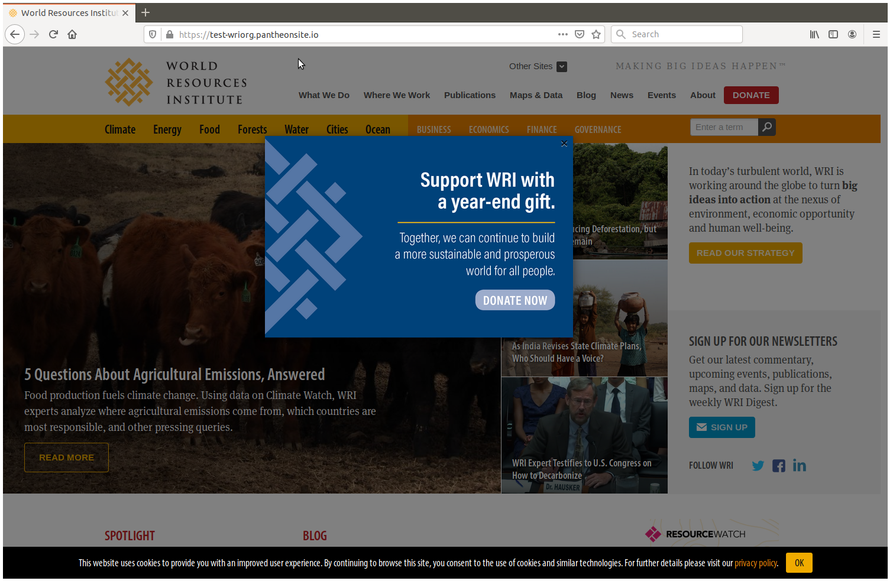

# module-wri_modal_page

Creates a modal for specifics pages. This module has been customized from the contrib module "modal_page" (v1.2) by WRI Comms to include a cookie check, option to display on all pages, and custom styling.

